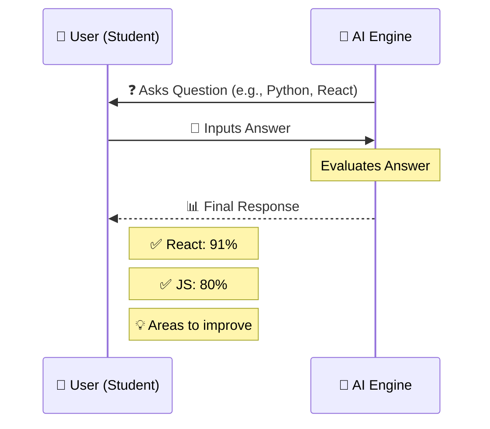
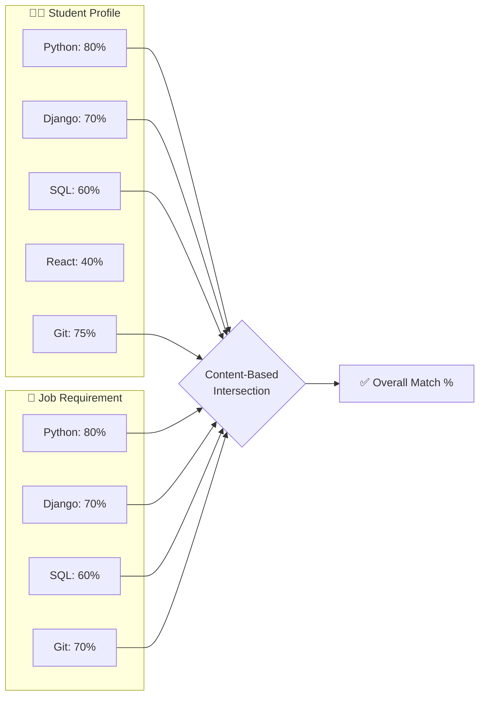

<div align="center">
  
  
  
  

  <br/>
  <br/>

  <h1>🎓 Portal for Academic-Industry Collaboration</h1>
  
  <blockquote>
    <p><b>A unified platform bridging the gap between Academia and Industry through intelligent skill mapping, content-based recommendations, and seamless collaboration.</b></p>
  </blockquote>
  
</div>

<br/>

## 📖 Overview

This platform connects **Students, Colleges, Faculty, and Companies** into a single, cohesive ecosystem. It tackles the industry-academia gap head-on by offering an intelligent skill assessment mechanism, dynamic skill mapping, and targeted content-based recommendations—ensuring students are industry-ready and companies find exactly the talent they need.

---

## 👥 User Ecosystem

| 🎭 Role | 🎯 Core Objective | ⚡ Key Capabilities |
| :--- | :--- | :--- |
| 🧑‍🎓 **Student** | Skill assessment & career growth | Take assessments, find internships/jobs, track applications, digital portfolio. |
| 👨‍🏫 **Faculty** | Professional development & research | Find FDPs, industrial training, consultancies, guest lectures. |
| 🏢 **Industry** | Talent acquisition & training | Post jobs/internships, create live projects, conduct workshops, mentor students. |
| 🏫 **Admin** | Analytics & institution monitoring | Track placement rates, analyze skill gaps, monitor industry demand. |

---

## 🚀 Core Modules & Features

### 1️⃣ Student Ecosystem (Core Focus)
- 📝 **Comprehensive Registration:** Capture education, skills, projects, and career interests.
- 🧠 **AI Skill Assessment:** Take technical & soft skill tests (e.g., Python, SQL). Get proficiency scores and actionable feedback.
- 🔗 **Skill Mapping:** Dynamically compare student skills against industry requirements.
- 🌐 **Digital Portfolio:** A verified, shareable public/private profile for every student.

### 2️⃣ AI Recommendation Engine
- ⚙️ **Content-Based Filtering:** Matches the union of student skills and job requirements. No overly complex ML models needed—just pure, effective logic!
- 🎯 **Smart Matches:** Suggests highly relevant Jobs (e.g., *Django Developer - 87% Match*) and Internships.

### 3️⃣ Academic-Industry Collaboration 
- 🛠️ **Live Industry Projects:** Companies post real-world projects (e.g., *AI Customer Support System* by ABC Tech). Student teams of 5 can apply for a 3-month sprint.
- 🎤 **Workshops & Mentorship:** Companies host "Industry Ready" workshops (e.g., *15 Sept, Online*). Features include integrated chat, meeting scheduling, and progress tracking.

### 4️⃣ Industry & Internship Portal
- 💼 **Robust Hiring:** Companies create detailed postings (Required Skills, Duration, Stipend, Eligibility).
- 📊 **Recruiter Dashboard:** Automatically ranks applicants based on the AI recommendation engine's match percentage.

### 5️⃣ Institution/Admin Analytics Dashboard
Empowers colleges with data-driven decision-making tools:
- 📈 **High-Level Stats:** Track total students (e.g., 4250), assessments (3820), and active opportunities (146).
- 📉 **Skill Gap Analytics:** Identify lacking skills among students (e.g., *Cloud Computing: 1820 students lacking*).
- 🔮 **Industry Demand Analytics:** Forecast skill trends (e.g., *Python 32%, AI/ML 27%*) so colleges know exactly which skills to teach.

### 6️⃣ Trust & Verification System
- ✅ **Multi-Level Verification:** Certificates verified by Institutions, Internships verified by Companies, Projects verified by Faculty.
- 🔐 **Digital Trust:** Generates a unique Verification ID or QR Code for each student profile to ensure authenticity.

---

## ⚙️ Installation & Setup

Follow these instructions to get the project up and running on your local machine.

### Prerequisites
- [Python](https://www.python.org/) (v3.9+)
- Django (installed via requirements)

### 1. Clone the Repository
```bash
git clone https://github.com/akshaykumar401/SIH---2026.git
cd "SIH---2026"
```

### 2. Set Up the Environment
```bash
# Create a virtual environment
python -m venv .venv

# Activate the virtual environment
# On Windows:
.venv\Scripts\activate
# On macOS/Linux:
source .venv/bin/activate
```

### 3. Install Dependencies
```bash
# Install required Python packages
pip install -r requirements.txt
```

### 4. Run the Application
```bash
# Navigate to the main project directory
cd SkillBridge

# Run database migrations
python manage.py migrate

# Start the Django development server
python manage.py runserver

# And another terminal for Tailwind server
python manage.py tailwind start
```

---
## 🧠 Technical Workflows

### 1. AI Skill Assessment Loop
This represents how the AI interacts with the student to assess their skills and provide feedback.

<div align="center">



</div>

### 2. Content-Based Recommendation Logic
This demonstrates exactly how the matching algorithm works: comparing the student's skills against the job requirements to find the intersection and calculate the overall match percentage.

<div align="center">



</div>

---

## 🗺️ Sitemap (Estimated Pages)

<details>
<summary><b>🌍 Public Pages</b></summary>

1. Home
2. About
3. Industries
4. Opportunities
5. Training Programs
6. Workshops
7. Login
8. Registration

</details>

<details>
<summary><b>🧑‍🎓 Student Portal</b></summary>

1. Student Dashboard
2. Profile
3. Skill Assessment
4. Skill Profile
5. Skill Gap
6. Recommended Jobs
7. Recommended Internships
8. Recommended Courses
9. Applications
10. Application Details
11. My Internship
12. Projects
13. Certifications
14. Achievements
15. Digital Portfolio
16. Resume Builder
17. Messages
18. Notifications
19. Settings

</details>

<details>
<summary><b>🏢 Industry Portal</b></summary>

1. Industry Dashboard
2. Company Profile
3. Post Job
4. Post Internship
5. Post Project
6. Training Programs
7. Applications
8. Candidates
9. Candidate Details
10. Shortlisting
11. Interviews
12. Mentorship
13. Analytics

</details>

<details>
<summary><b>👨‍🏫 Faculty Portal</b></summary>

1. Faculty Dashboard
2. Profile
3. Faculty Internship
4. FDP (Faculty Development)
5. Industrial Training
6. Research Projects
7. Consultancy
8. Workshops
9. Applications
10. Collaboration

</details>

<details>
<summary><b>🏫 Institution/Admin Portal</b></summary>

1. Admin Dashboard
2. Students
3. Faculty
4. Industry
5. Opportunities
6. Skill Analytics
7. Internship Analytics
8. Placement Analytics
9. Industry Demand
10. Reports
11. Verification
12. System Settings

</details>

---

## 🤝 Team Members

<div align="center">
  <table>
    <tr>
      <td align="center" width="33%">
        <a href="https://github.com/akshaykumar401">
          
          <br />
          <sub><b>Akshay Kumar</b></sub>
        </a>
      </td>
      <td align="center" width="33%">
        <a href="https://github.com/ayushi-309">
          
          <br />
          <sub><b>Ayushi Tiwary</b></sub>
        </a>
      </td>
      <td align="center" width="33%">
        <a href="https://github.com/R27riyaSharma">
          
          <br />
          <sub><b>Riya Kumari</b></sub>
        </a>
      </td>
    </tr>
    <tr>
      <td align="center" width="33%">
        <a href="https://github.com/ujjawalsingh82">
          
          <br />
          <sub><b>Ujjawal Singh</b></sub>
        </a>
      </td>
      <td align="center" width="33%">
        <a href="https://github.com/arbind233">
          
          <br />
          <sub><b>Arbind Kumar</b></sub>
        </a>
      </td>
      <td align="center" width="33%">
        <a href="https://github.com/parrthhh02">
          
          <br />
          <sub><b>Ayush Aman</b></sub>
        </a>
      </td>
    </tr>
  </table>
</div>

<br/>
<div align="center">
  <p>Built with ❤️ for SIH 2026</p>
</div>
